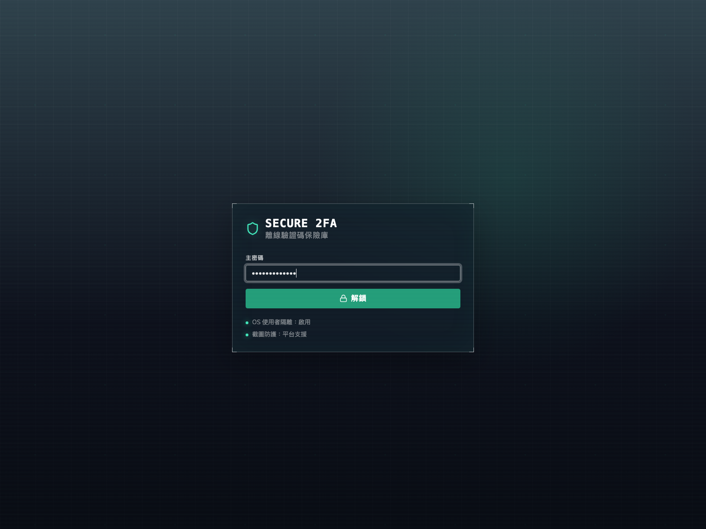
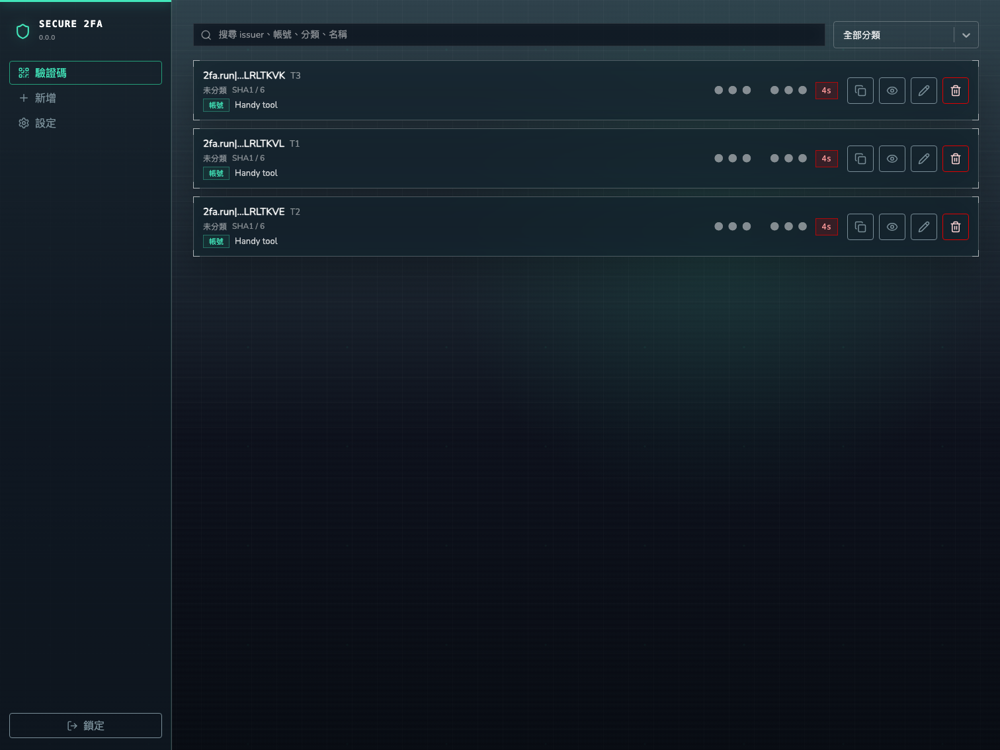
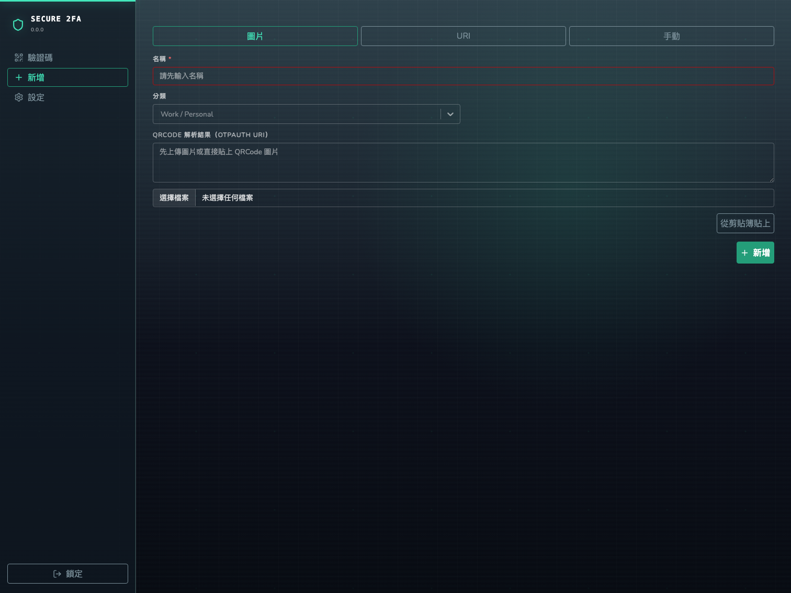
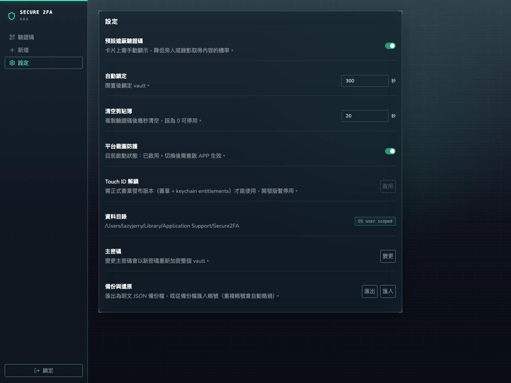

# Secure 2FA

跨平台桌面 2FA authenticator，使用 Wails v2、Go、React、TypeScript。實作目錄位於 `secure2fa/`。

## 已實作

- 本機離線 TOTP 產生與倒數更新。
- 主密碼建立/解鎖 vault。
- Vault 內容以 Argon2id 衍生金鑰，AES-GCM 加密儲存在本機。
- OS 使用者隔離：預設資料位置由 `os.UserConfigDir()` 決定。
- 帳號管理：新增、編輯 metadata、刪除、搜尋、分類、備註。
- 匯入方式：手動 secret、`otpauth://` URI、鏡頭 QR 掃描。
- 複製驗證碼與可設定剪貼簿清空秒數。
- 設定頁：遮蔽驗證碼、自動鎖定、剪貼簿清空、截圖防護狀態、資料目錄。
- macOS/Windows Wails `ContentProtection` 已啟用。

## 畫面截圖

截圖使用 mock vault 資料；驗證碼維持遮蔽狀態，避免文件中出現可用的一次性密碼。









## 安全邊界

- Backend 不把 TOTP secret 回傳給 frontend；frontend 只取得 metadata 與目前驗證碼。
- Vault 鎖定後，backend API 會拒絕讀取帳號與驗證碼。
- 密碼不落地儲存；記憶體內只保留解鎖後的 session key。
- 截圖防護是平台 best-effort：macOS 使用 `NSWindowSharingNone`，Windows 使用 `SetWindowDisplayAffinity`。外部相機、惡意程式或具高權限的螢幕擷取仍不能保證完全阻擋。
- 生物驗證第一版未接入；需求中的「密碼或生物驗證」目前由主密碼滿足。

## macOS 截圖與隱私防護驗證

驗證前先確認設定頁「平台截圖防護」為啟用，然後重新啟動 APP。這個設定只在 Wails window 建立時套用。

| 項目 | 操作 | 預期結果 | 實機結果 |
| --- | --- | --- | --- |
| Screenshot 視窗截圖 | 使用 `Command + Shift + 4` 或 `Command + Shift + 5` 擷取 Secure 2FA 視窗 | 截圖內不應顯示驗證碼與帳號內容，或整個視窗被系統排除 | 待驗證 |
| QuickTime 螢幕錄製 | QuickTime Player 新增螢幕錄製，錄製 Secure 2FA 視窗 | 錄影不應顯示驗證碼與帳號內容，或視窗被系統排除 | 待驗證 |
| 螢幕分享 | 使用 FaceTime、Meet、Zoom 或 macOS Screen Sharing 分享包含 Secure 2FA 的畫面 | 分享畫面不應顯示驗證碼與帳號內容，或視窗被系統排除 | 待驗證 |
| APP 失焦 | 解鎖後切到其他 APP | Secure 2FA 立即套用隱私遮蔽 | 待驗證 |
| 最小化 | 解鎖後最小化 Secure 2FA | 最小化前不應留下可讀驗證碼畫面；回復視窗後可正常解除遮蔽 | 待驗證 |
| 切換桌面 | 解鎖後切換 macOS Desktop / Space | 離開目前桌面時立即遮蔽，回到 APP 後解除遮蔽 | 待驗證 |

限制：

- Wails `ContentProtection` 是平台層 best-effort 防護，不等同 DRM。
- 設定頁切換「平台截圖防護」後需重新啟動 APP。
- 外部相機、具高權限的擷取程式、惡意程式或 OS 行為變更仍可能繞過防護。
- 前端隱私遮蔽依賴 `blur`、`focus`、`visibilitychange` 事件；實機驗證需涵蓋失焦、最小化與桌面切換。

## 開發

```bash
cd secure2fa
wails dev
```

Wails dev 會啟動 Vite dev server。瀏覽器開發入口由 Wails 自動配置，通常可從 dev output 看到。

## 驗證

```bash
cd secure2fa
go test ./...
cd frontend && npm run build
cd .. && wails build -skipbindings
```

CI 會在 GitHub Actions 的 macOS runner 執行：

- `npm audit --audit-level=moderate`
- `go test ./...`
- `npm run build`
- `scripts/package-macos.sh`

截圖防護相關自動化驗證：

- `secure2fa/privacy_protection_test.go`：確認 `GetSetupState()` 會反映啟動時的 ContentProtection 狀態。
- `secure2fa/privacy_protection_test.go`：確認設定頁保存的截圖防護開關會寫入下次啟動設定。

## 輸出

macOS build smoke test 已產生：

```text
secure2fa/build/bin/secure2fa.app/Contents/MacOS/secure2fa
```

建立 unsigned release package：

```bash
cd secure2fa
bash scripts/package-macos.sh
```

預設輸出：

```text
secure2fa/build/release/secure2fa.app
secure2fa/build/release/secure2fa-macos-<version>-unsigned.zip
```

可選參數：

- `MACOS_PLATFORM=darwin/universal`：建立 universal macOS package。
- `CREATE_DMG=1`：額外輸出 `.dmg`。
- `SIGN_IDENTITY="Developer ID Application: ..."`：執行 Developer ID signing。
- `NOTARIZE=1` 搭配 `APPLE_ID`、`APPLE_TEAM_ID`、`APPLE_APP_SPECIFIC_PASSWORD`：送出 notarization，通過後 stapling，再重新產生 zip。
